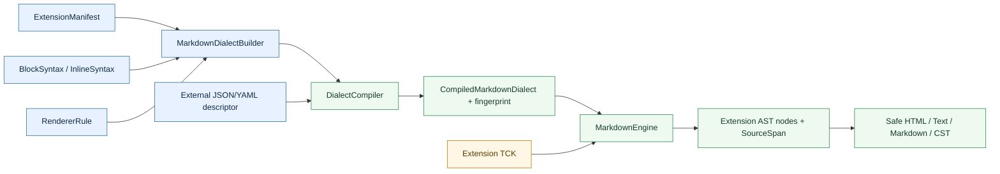
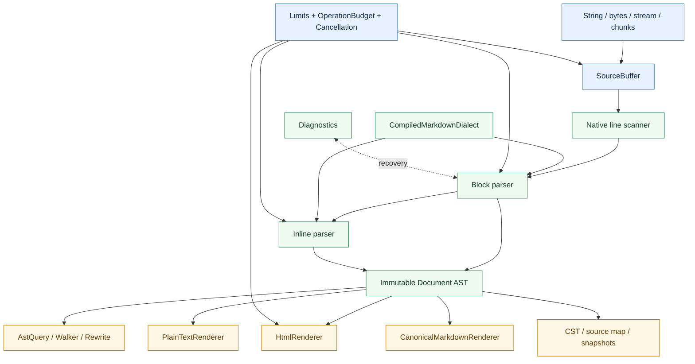

<!-- BEAUTIFIED -->

<div align="center">

# markdown

面向仓颉的可扩展 Markdown 解析基础设施：从字节级 `SourceSpan` 到安全 HTML、版本化方言与文档工具链。

[](cjpm.toml)
[](docs/profiles.md)
[](docs/profiles.md)
[](LICENSE)
[](docs/performance.md)
[](https://openai.com/codex/)

[快速开始](#快速开始) · [API 导航](docs/api.md) · [扩展体系](#扩展体系) · [性能证据](#性能对比)

</div>

> [!IMPORTANT]
> 当前版本是可评估的 pre-GA 候选，不是已发布到中心仓的稳定包。CommonMark/GFM、构建和安全门槛已有证据；相对原生参考实现的性能门槛仍未通过，详见[性能对比](#性能对比)。

## 目录

- [为什么选择 markdown](#为什么选择-markdown)
- [快速开始](#快速开始)
- [常用场景](#常用场景)
- [扩展体系](#扩展体系)
- [架构](#架构)
- [性能对比](#性能对比)
- [功能对比](#功能对比)
- [文档导航](#文档导航)
- [安全](#安全)
- [参与贡献](#参与贡献)

## 为什么选择 markdown

- **规范基线明确**：提供 CommonMark `0.31.2` 与 GFM `0.29` profile；官方语料分别通过 `652/652`、`671/671`。
- **安全输出默认开启**：`HtmlOptions.safe()` 转义 raw HTML，分离链接与图片 URI 策略，并受 cancellation 与 output budget 约束。
- **AST 可回溯到源码**：不可变节点携带 UTF-8 byte `SourceSpan`；同时提供 UTF-16、visual position、`SourceSlice` 与 `AstQuery`。
- **扩展是版本化协议**：`ExtensionManifest`、`MarkdownDialect`、`BlockSyntax`、`InlineSyntax` 与 `RendererRule` 共同定义依赖、冲突、优先级、能力和输出降级。
- **边界可观察**：支持 String、bytes、stream、chunked input，具有资源上限、operation budget、取消、结构化诊断与 partial result。
- **不只生成 HTML**：同一文档可输出 Safe/Spec/GFM HTML、纯文本、canonical Markdown、source map、CST/snapshot，并可通过 `markdown` CLI lint、format、check 与 explain。

## 快速开始

下面使用源码依赖。`cjpm.toml` 不会展开环境变量，因此示例由 shell 中的 `MARKDOWN_PATH` 生成实际绝对路径。

### 1. 准备消费工程

```sh
mkdir -p markdown_demo/src
cd markdown_demo
export MARKDOWN_PATH=/absolute/path/to/markdown
```

基础包只需要 Cangjie `1.1.0` 和 Python 3；纯仓颉构建不需要 C 编译器、归档器或原生链接参数。

### 2. 生成 `cjpm.toml`

```sh
python3 - <<'PY'
import os
from pathlib import Path

path = os.environ["MARKDOWN_PATH"]
Path("cjpm.toml").write_text(f'''[package]
  cjc-version = "1.1.0"
  name = "markdown_demo"
  version = "0.8.0"
  output-type = "executable"
  compile-option = "-O2"
  link-option = ""

[dependencies]
  "markdown" = {{ path = "{path}", output-type = "static" }}
''')
PY
```

### 3. 解析并输出安全 HTML

```cangjie
package markdown_demo

import markdown.*

main(): Int64 {
    let result = Markdown.parse("# Hello\n\n[link](https://example.com)")
    println(HtmlRenderer().render(result.document))
    0
}
```

```sh
cangjie_env
cjpm run
```

仓库内另有只依赖公开 API 的可运行示例：[examples/quickstart](examples/quickstart)。

## 常用场景

### 安全处理不可信 Markdown

```cangjie
let html = Markdown.toSafeHtml("<script>alert(1)</script> [x](javascript:alert(1))")
println(html)
```

`Markdown.toSafeHtml` 使用安全默认值；兼容规范的 raw HTML 行为必须通过 `HtmlOptions.specCompatible()` 显式选择。对最终网页仍可通过 `HtmlSanitizerPort` 组合宿主 sanitizer。

### 查询 AST 与源码范围

```cangjie
let result = Markdown.parse("# One\n\n## Two")
for (heading in AstQuery.headings(result.document)) {
    if (let Some(span) <- heading.span) {
        println("level=${heading.level}, source=${result.source.slice(span)}")
    }
}
```

`SourceSpan` 使用 UTF-8 byte offset；编辑器接入可使用 `SourceBuffer.utf16Position` 与 `visualPosition`。

### 注册块语法与渲染规则

```cangjie
package markdown_extension_demo

import markdown.*

main(): Int64 {
    let manifest = ExtensionManifest(
        "docs", "1.0.0", "example-1",
        capabilities: ExtensionCapabilities(safeHtml: true)
    )
    let dialect = MarkdownDialect
        .define("docs-v1", "1.0.0")
        .enable(manifest)
        .block(BlockSyntax.define("docs", "container").opener(":::").closer(":::"))
        .renderer(RendererRule("docs", "note", "aside", classToken: "note"))
        .build()
    let engine = MarkdownEngine.builder().dialect(dialect).build()
    let document = engine.parse(":::note title=Read\n**important**\n:::").document
    println(engine.htmlRenderer(options: HtmlOptions.safe()).render(document))
    0
}
```

### 设置资源上限与取消

```cangjie
let source = CancellationSource()
let engine = MarkdownEngine.builder().limits(ParseLimits.safe()).build()
source.cancel()
try {
    engine.parse("large input", cancellation: source.token, budget: OperationBudget.safe())
} catch (error: MarkdownException) {
    println("code=${error.code}, phase=${error.phase}")
}
```

## 扩展体系

扩展不是一个只留接口的 AST 节点。方言编译器会把 manifest、块/行内语法、renderer、依赖和冲突解析成不可变的 `CompiledMarkdownDialect`，其 fingerprint 可用于缓存和 artifact 校验。



关键约束：

- `ExtensionManifest` 声明 semantic/implementation/SPI version、profile、依赖、冲突、capabilities、rule budget、trust level 与 missing-renderer policy。
- 规则优先级与冲突在 dialect compile 阶段确定；重复、循环依赖、越权 capability 和未覆盖 renderer 会产生结构化失败，不依赖注册顺序碰运气。
- `BlockSyntax`/`InlineSyntax` 定义边界、名称、typed parameters、转义、正文与嵌套模式；生成的扩展节点保留 `SourceSpan` 和诊断上下文。
- renderer 必须声明 Safe HTML、plain text、Markdown、format/CST 等覆盖范围；缺失行为按 manifest 的明确策略处理。
- `MarkdownExtensionTestKit` 覆盖 chunk invariance、span、嵌套/未闭合语法、冲突、limits、cancellation、renderer/formatter、fuzz smoke 与 determinism。
- 外部 JSON/YAML descriptor 只携带数据，不能携带可执行 callback；宿主代码插件拥有宿主进程权限。`IsolatedPluginRunner` 定义 fail-closed IPC contract，但 OS sandbox 必须由宿主 transport 创建，库不宣称进程内 callback 已被隔离。

可选的 `OfficialExtensions.p1Dialect()` 包含默认关闭的 Footnotes、Front Matter、Math、Definition Lists、Heading IDs 和 Smart Punctuation。完整协议见[扩展指南](docs/extensions.md)、[Syntax DSL](docs/syntax-dsl.md)、[Renderer DSL](docs/renderer-dsl.md)与[Extension TCK](docs/extension-tck.md)。

## 架构



公开入口是 `Markdown` facade 和 `MarkdownEngine.builder()`。核心 Cangjie 包只依赖标准库；C 行扫描器是显式构建、静态链接的窄边界。整输入 foreign 函数没有标注 `@FastNative`，因为执行时间随输入长度变化，不能证明始终短时有界。

默认所有入口都走纯仓颉 scanner。需要原生加速时，显式执行 `scripts/build_native_scanner.py --enable`、在消费端为目标平台配置 archive/linker，并从 `markdown.native` 注入 `NativeLineScanner()`；未导入该子包时不存在 foreign 符号或原生链接依赖。Linux/macOS/MinGW 使用 `CC`/`AR`，MSVC 使用 `cl`/`lib`，交叉编译通过 `--target` 传入 target triple。完整命令和输入 profile 见[输入与资源](docs/input-and-resources.md)。

公开表面按用途提供精选子包：`markdown.core`、`markdown.render`、`markdown.extensions`、`markdown.editor`、`markdown.artifact`、`markdown.document` 和 `markdown.testkit`。根 `markdown.*` 保留为兼容门面；新代码应优先导入所需子包，避免无意绑定编辑器、artifact 或 testkit API。

## 性能对比

### 同语言库：markdown4cj

对比对象固定为公开仓库 [`Cangjie-TPC/markdown4cj`](https://gitcode.com/Cangjie-TPC/markdown4cj/tree/develop) 的 `develop` 提交 `f43cfb3ae1cd3092d9a8a94332c64815fc4572f9`。测量只抽取其平台无关 `src/core/**`，用当前 SDK 和固定 `commonmark4cj` 提交构建；不包含 DevEco、OHOS UI、`components`、prism4cj 或 formula-ffi。

| CommonMark parse-only（256 KiB） | markdown 相对加速 |
| --- | ---: |
| official-spec | 8.53× |
| readme-api | 9.66× |
| large-code | 4.15× |
| large-table | 50.27× |
| many-references | 8.60× |
| CJK | 6.55× |
| emoji | 14.78× |
| deep-list | 10.77× |
| pathological-delimiters | 13.78× |
| long-line | 11.42× |
| ordinary | 11.70× |
| **几何平均** | **11.00×** |

协议为同主机、同一 Cangjie `1.1.0-alpha.20260817040003` SDK、release `-O2`、CPU 2、每进程 3 iterations、每侧 1 次 warmup + 7 个交替样本。12 个共享 CommonMark 用例的 HTML 逐字一致；11 个性能语料全部更快，最小加速 `4.15×`，逐语料峰值 RSS 比值最大约 `0.66×`。因此本库已有可复核的**同语言 parse-only 高性能证据**。

这不是 renderer 对比：`markdown4cj` 的公开渲染结果是 HarmonyOS `NodeView`，没有与本库 `HtmlRenderer` 等价的 HTML 字符串性能入口。可复核 runner、兼容层边界和原始样本见 [`benchmarks/compare_markdown4cj.py`](benchmarks/compare_markdown4cj.py)、[同语言比较报告](docs/reports/markdown4cj-comparison.md)和[raw report](docs/reports/markdown4cj-comparison-raw.json)。

### 原生参考实现

原生 C 的 cmark/cmark-gfm 用于定位性能下限，不属于同语言产品对比。

<!-- release-evidence:start -->
| Release evidence | Value |
| --- | --- |
| Version / status | `0.8.0` / `draft` |
| Source commit | `0275f27a1d8fea38262127b245ca5e4c81c9b3a8` |
| CommonMark / cmark | `5.84x` / limit `2.5x` |
| GFM HTML / cmark-gfm | `4.98x` / limit `2.5x` |
| Benchmark identity | `current`; commit `0275f27a1d8fea38262127b245ca5e4c81c9b3a8`; SDK `1.1.0-alpha.20260803040049` |

The table is generated from [`release-evidence.json`](release-evidence.json).
It is commit-bound benchmark evidence, but the release remains a fail-closed
dirty draft until every mandatory gate passes and the evidence changes are committed.
<!-- release-evidence:end -->

历史测量仅保留在[性能说明](docs/performance.md)中，不再作为“当前值”。发布报告、README 和验收报告中的 canonical 数字都来自同一个 `release-evidence.json`。当前 source commit、SDK、语料和 raw digest 已全部绑定；仍需两个性能 ratio gate 通过、工作树 clean 且 release 状态转为 ready，证据才能成为 release-ready。

## 功能对比

两者面向不同产品层：`markdown` 是跨宿主的解析/文档工具基础设施；`markdown4cj` 是面向 HarmonyOS 的 Markdown 解析与 UI 展示组件。表格只记录固定提交源码或公开文档声明的能力。

| 维度 | markdown | markdown4cj `f43cfb3a` |
| --- | --- | --- |
| 产品定位 | 通用静态库、CLI 与文档系统 API | HarmonyOS HAR、`MarkdownComponent` 与 `NodeView` |
| CommonMark / GFM | 明确锁定 CommonMark 0.31.2 与 GFM 0.29；官方语料 652/652、671/671 | 基于 `commonmark4cj` 并提供表格、删除线、task、autolink 等插件；公开文档未声明规范版本和官方语料成绩 |
| AST / SourceSpan | 不可变 AST、NodeId、UTF-8 byte span、UTF-16/visual mapping、SourceSlice | 暴露 commonmark Node/NodeView；公开 API 未声明逐节点源码范围契约 |
| 输出 | Safe/Spec/GFM HTML、plain text、canonical Markdown、CST、source map、artifact | NodeView/HarmonyOS UI，主题、代码高亮、图片、公式、音频等展示能力 |
| HTML 与 URI 安全 | Safe HTML 默认、raw policy、Link/Image URI policy、sanitizer port、output budget | 支持一组 HTML 标签和属性；公开安全文档未声明默认 URI policy 或 sanitizer contract |
| 扩展与插件 | versioned manifest、typed syntax/renderer DSL、依赖/冲突、fingerprint、TCK、external descriptor、isolation contract | `MarkdownPlugin` 可配置 parser/visitor、pre/post-process，Registry 处理依赖且插件顺序有语义 |
| 流式 / 增量 | buffered bytes/stream/chunk feed；snapshot、range edit、preserving edit；等长纯文本的 block-local fast path | UI 文档声明全量/增量加载渲染 |
| 取消 / 资源限制 / 诊断 | CancellationToken、ParseLimits、OperationBudget、typed diagnostic、partial result | 公开 API 文档未声明对应的统一契约 |
| 工具链 | CLI render/parse/format/check/explain/dialect；lint/fix、formatter、CST、source map | 公开文档聚焦 HAR/UI 使用，未声明独立 CLI、lint/format/source-map/CST |
| UI / 主题 / 媒体 | 核心不绑定 UI；由宿主 renderer/adapter 实现 | MarkdownComponent、深浅主题、文本/表格样式、代码高亮、图片/公式/音频等 |

## 文档导航

| 任务 | 文档 |
| --- | --- |
| 选择 CommonMark/GFM 行为 | [Profiles](docs/profiles.md)、[迁移说明](docs/migration.md) |
| 使用 AST、位置和输入 | [AST](docs/ast.md)、[Source position](docs/source-position.md)、[Input & resources](docs/input-and-resources.md) |
| 定义方言与扩展 | [Dialect DSL](docs/dialect-dsl.md)、[Syntax DSL](docs/syntax-dsl.md)、[Renderer DSL](docs/renderer-dsl.md)、[SPI versions](docs/spi-and-schema-versions.md) |
| 验证扩展 | [Extension guide](docs/extensions.md)、[Extension TCK](docs/extension-tck.md)、[External schema](docs/external-dialect-schema.md) |
| 输出与编辑 | [Formatting](docs/formatting.md)、[Document systems](docs/document-systems.md) |
| 集成 CLI 与服务 | [CLI](docs/cli.md)、[Concurrency & observability](docs/concurrency-and-observability.md)、[Errors & capabilities](docs/errors-and-capabilities.md) |
| 审核发布证据 | [Performance](docs/performance.md)、[Security](docs/security.md)、[Compatibility](docs/versioning-and-compatibility.md)、[API map](docs/api.md) |

## 安全

处理不可信内容时使用 `Markdown.toSafeHtml` 或 `HtmlOptions.safe()`；不要把 `specCompatible()` 当成 sanitizer。代码扩展拥有宿主进程权限，外部 worker 的文件、网络和子进程限制必须由宿主 OS/transport 执行。

仓库已启用 GitHub Private Vulnerability Reporting。请通过 [Security Advisories 私密报告入口](https://github.com/lIlIIlIll/markdown/security/advisories/new) 提交漏洞，不要在公开 issue 中披露。请附带受影响版本/profile、最小输入、配置、观察到的资源使用或输出，以及复现步骤。完整流程见 [SECURITY.md](SECURITY.md) 与[安全指南](docs/security.md)。

## 参与贡献

提交变更前请保持公开 API、文档与行为一致，并运行与改动相关的 focused tests。完整发布门槛由 `scripts/release_gate.sh` 编排；性能 smoke 不能替代正式 fixed-host benchmark，扩展接口变更必须同步 Extension TCK 与兼容性说明。

仓库使用 Codex 辅助开发；“Developed with Codex”仅描述开发过程，不表示库在运行时依赖 Codex、OpenAI API 或任何外部服务。

## License

[MIT](LICENSE) © markdown contributors.
